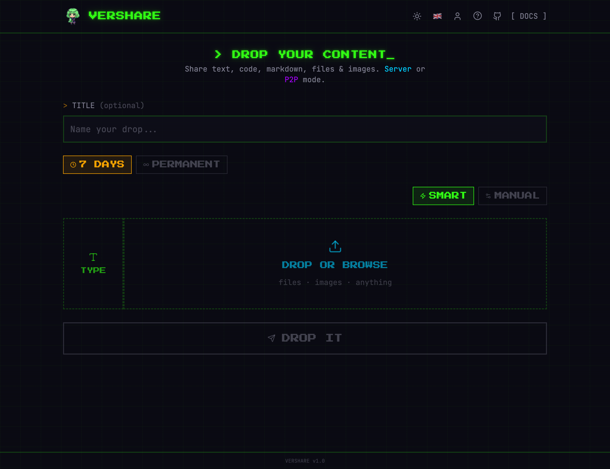
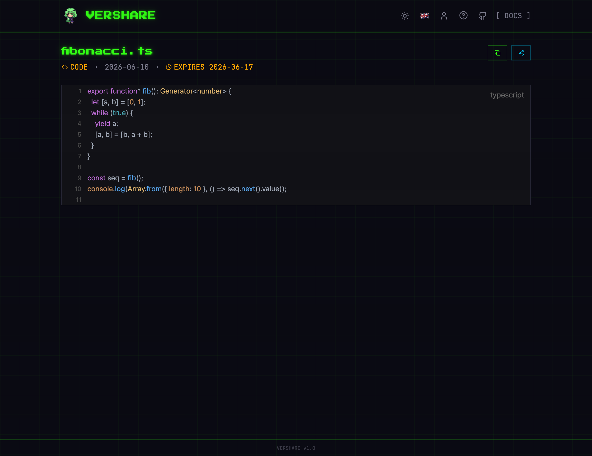
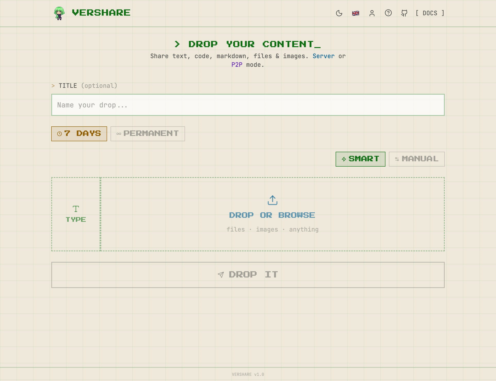
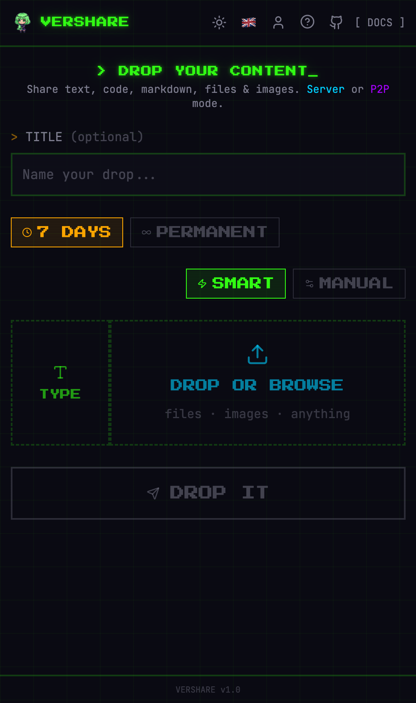

<p align="center">
  
</p>

<h1 align="center">VerShare</h1>

<p align="center">
  <b>Drop anything. Share everything.</b> ✦<br/>
  Free, fast & simple sharing for files, images, text, code and markdown —<br/>
  wrapped in a cozy pixel-art terminal. 🌱
</p>

<p align="center">
  <a href="https://vershare.uk"><b>🚀 vershare.uk</b></a> · <a href="https://vershare.uk/doc">API docs</a>
</p>

---

## ✨ What it does

- **Smart Drop** — paste or drop anything; text, markdown and code are auto-detected and rendered with live previews
- **Files & media** — images, video, audio, PDFs up to 50 MB, streamed with range support
- **P2P mode** — browser-to-browser over WebRTC; nothing ever touches the server
- **Auto-expiry** — drops vanish after 7 days; sign in (email or Google) to make them permanent, extend or renew them
- **In-page tabs** — open your recent drops side by side without leaving the page
- **Speaks your language** — English · 中文 · Español · Français · Deutsch · 日本語, auto-detected
- **Two moods** — neon-on-dark terminal or a warm paper light theme
- **Agent-friendly API** — one `curl` to share, plain-text URL back

## 📸 Tour

| Home | Share view |
|------|-----------|
|  |  |

**Light theme** — warm paper, same pixels ☀️



<p align="center">
  <br/>
  <sub>pocket-sized too 📱</sub>
</p>

## ⚡ Share from anywhere

```bash
# share text — get a link back
curl -X POST https://vershare.uk/api/drop \
  -H 'Content-Type: application/json' \
  -d '{"type":"code","content":"console.log(\"hi\")","language":"javascript"}'

# share a file
curl -X POST https://vershare.uk/api/drop -F type=file -F file=@photo.png
```

Full API & CLI helpers at [vershare.uk/doc](https://vershare.uk/doc).

## 🛠 Stack

Next.js 16 · React 19 · Tailwind 4 — running at the edge on **Cloudflare Workers** with **D1** (metadata, users) and **R2** (content), deployed via OpenNext. PeerJS for P2P, Resend for verification emails, Google Identity Services for one-tap sign-in.

## 🏃 Run it yourself

```bash
git clone https://github.com/Shadowhusky/vershare.git
cd vershare
npm install
cp .env.example .env.local      # fill in admin credentials
npx wrangler d1 migrations apply vershare-db --local
npm run dev
```

Deploying your own instance needs a Cloudflare account:

```bash
npx wrangler d1 create vershare-db      # put the id in wrangler.jsonc
npx wrangler r2 bucket create vershare-files
npx wrangler d1 migrations apply vershare-db --remote
npx wrangler secret bulk <(cat .env.local | your-favourite-json-converter)
npm run deploy
```

### Environment

```env
ADMIN_USER=admin
ADMIN_PASS=your-password
ADMIN_SECRET=your-secret-key

# optional
RESEND_API_KEY=re_xxxxx                      # verification emails
EMAIL_FROM=VerShare <noreply@yourdomain.com>
NEXT_PUBLIC_GOOGLE_CLIENT_ID=xxx.apps.googleusercontent.com  # Google sign-in
```

## 📄 License

MIT
